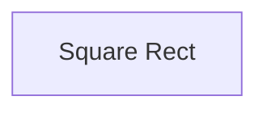

# Ajaxpaginator плагин для CakePHP

## Инсталяция

Вы можете установить этот плагин в свое приложение CakePHP с помощью [composer](https://getcomposer.org).

Установка плагина:

```
$ sudo composer require your-name-here/ajaxpaginator
$ sudo composer dumpautoload
```

#### Инициализация

1. Вставить в шаблон страницы (с расширением "ctp") следующий код:

```php
<?php
    $this->Paginator->setTemplates([
        'nextActive' => '
        <input class="hide" value="{{url}}">' .
        '<div id="list-pag">' .
            $this->element('preloader', ['loader_id' => 'sub-loader', 'w' => 56, 'h' => 56]) .
        '</div>',
        'nextDisabled' => '',
    ]);
?>
<?= $this->Paginator->next() ?>
```

2. В шаблон, который используется при возврате AJAX-запроса, вставить:

```php
<?php
    $this->Paginator->setTemplates([
        'nextActive' => '<input class="hide" value="{{url}}">',
        'nextDisabled' => '',
    ]);
?>
<?= $this->Paginator->next() ?>
```

3. В _JavaScript_ коде для конкретной страницы инициализировать ajaxpaginator:

```js
$( '#list-pag' ).verticalPaginator({ viewLoader: 'preloader' });
```

Полный перечень настроек ajaxpaginator:

```js
@param {object} this.element
    Объект оболочки, где расположена кнопка и прелоадер.
@param {string} viewLoader
    Когда запрашивать новую страницу:
        "button-preloader" - при нажатие кнопки показывать следующую страницу;
        "preloader" - при достижение конца страницы показывать следующую страницу.
@param {int} retreat
    Добавочный отступ к расстоянию до элемента, при котором включается AJAX-код. Действует только для "viewLoader=preloader".
@param {string} paste
    Куда вставлять html код, вернувшийся от AJAX-кода:
        "before" - перед объектом this.element;
        "after" - после объекта this.element.
```

#### Описание работы

Шаблон включает в себя оболочку (this.element) внутри которой располагается труббер и кнопка. Оболочка обычно представляет собой открывающийся и закрывающийся тег <div>. Труббер, располагающийся внутри оболочки, должен иметь класс "trubber", а кнопка - класс "button-preloader". Перед или после оболочки (this.element) располагается скрытое поле, содержащее адрес AJAX-запроса, а также GET параметр "page", содержащий в свою очередь, номер запрашиваемой страницы. В зависимости от того, куда необходимо выводить полученный код от AJAX-запроса, скрытое поле необходимо располагать перед или после оболочки (this.element).


                                            this.element (<div>...</div>)
                                          /
Скрытое поле с адресом <input...>        /
+---------------------------------------+
|   "труббер" class="trubber"           |
|   "кнопка" class="button-preloader"   |
+---------------------------------------+
Скрытое поле с адресом <input...>

