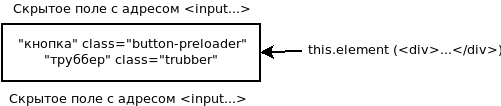

# Ajaxpaginator плагин для CakePHP

## Инсталяция

Вы можете установить этот плагин в свое приложение CakePHP с помощью [composer](https://getcomposer.org).

Установка плагина:

```
$ sudo composer require valeriy-brunov/ajaxpaginator
$ sudo composer dumpautoload
```

#### Инициализация

1. В основном шаблоне, который выводит листинг объектов, необходимо найти цикл отвечающий за вывод листинга. Обычно листинг выводится через цикл _foreach, for_ и др. Найденный цикл необходимо вырезать из шаблона и создать из него элемент. Вырезанный цикл в основном шаблоне необходимо заменить только что созданным элементом.

2. Вставить в основной шаблон страницы следующий код:

```php
<?php
/**
 * Plugin ajaxpaginator for base template.
 */
?>
<?php
    $this->Paginator->setTemplates([
        'nextActive' => '
        <input class="hide" value="{{url}}">' .
        '<div id="list-pag">' .
            $this->element('ajaxpaginator.preloader', ['loader_id' => 'sub-loader', 'w' => 56, 'h' => 56]) .
        '</div>',
        'nextDisabled' => '',
    ]);
?>
<?= $this->Paginator->next() ?>
```

3. Создать в той же папке, где и находится основной шаблон страницы, дополнительный шаблон для _ajax_ запроса. Обычно, если основной шаблон называется _list.ctp_, то созданный _listajax.ctp_. Включить в шаблон _listajax.ctp_ созданный элемент из 1 пункта и добавить ниже строчку:

```php
<?php
/**
 * Plugin ajaxpaginator for ajax template.
 */
?>
<?php
    $this->Paginator->setTemplates([
        'nextActive' => '<input class="hide" value="{{url}}">',
        'nextDisabled' => '',
    ]);
?>
<?= $this->Paginator->next() ?>
```

4. Подключить в основном шаблоне страницы необходимые файлы JavaScript, CSS.

```php
<?php
/**
 * CSS и JS.
 */
?>
<?= $this->Html->script('Libajax.libajax', ['block' => true]) ?>
<?= $this->Html->script('Ajaxpaginator.verticalPaginator', ['block' => true]) ?>
```

5. В контроллер необходимо добавить:

```php
if ($this->request->is('ajax')) {
    // Основной шаблон.
    $this->viewBuilder()->setLayout('ajax');
    // Вид.
    $this->render('listajax');
    // В запросе методом GET токен отправляем в заголовке.
    $token = $this->request->getParam('_csrfToken');
    $this->response = $this->response->withHeader('X-CSRF-Token', $token);
}
```

6. В _JavaScript_ коде для конкретной страницы инициализировать ajaxpaginator:

```js
$( '#list-pag' ).verticalPaginator({ viewLoader: 'preloader' });
```

Полный перечень настроек ajaxpaginator:

```js
@param {object} this.element
    Объект оболочки, где расположена кнопка и прелоадер.
@param {string} viewLoader
    Когда запрашивать новую страницу:
        "button-preloader" - при нажатие кнопки показывать следующую страницу;
        "preloader" - при достижение конца страницы показывать следующую страницу.
@param {int} retreat
    Добавочный отступ к расстоянию до элемента, при котором включается AJAX-код. Действует только для "viewLoader=preloader".
@param {string} paste
    Куда вставлять html код, вернувшийся от AJAX-кода:
        "before" - перед объектом this.element;
        "after" - после объекта this.element.
```

#### Описание работы

Шаблон включает в себя оболочку _(this.element)_ внутри которой располагается труббер и кнопка. Оболочка обычно представляет собой открывающийся и закрывающийся тег _div_. Труббер, располагающийся внутри оболочки, должен иметь класс _"trubber"_, а кнопка - класс _"button-preloader"_. Перед или после оболочки _(this.element)_ располагается скрытое поле, содержащее адрес AJAX-запроса, а также GET параметр _"page"_, содержащий в свою очередь, номер запрашиваемой страницы. В зависимости от того, куда необходимо выводить полученный код от AJAX-запроса, скрытое поле необходимо располагать перед или после оболочки _(this.element)_.



После получения ответа от сервера скрытое поле будет заменено на _html_ код, полученный от сервера. Поэтому необходимо следить за тем, куда будет выводиться скрытое поле: если листинг объектов будет выводится выше оболочки _(this.element)_, необходимо, чтобы скрытое поле шло внизу листинга объектов. Такой вывод гарантирует, что скрытое поле будет расположенно перед оболочкой. Для правильной работы пагинатора необходимо следить, чтобы скрытое поле располагалось сразу перед или после оболочки _(this.element)_. Описанный выше шаблон (см. рисунок выше) необходимо размещать на странице, где необходима пагинация. Код, который возвращается от AJAX-запроса, должен содержать только скрытое поле. Поэтому в шаблоне, который использует AJAX-запрос, необходимо генерировать только скрытое поле. Ниже показано, каким образом это реализовать.

Также необходимо отметить, что если будет использоваться режим _"viewLoader=preloader"_, в оболочке _(this.element)_ кнопку можно не указывать.
